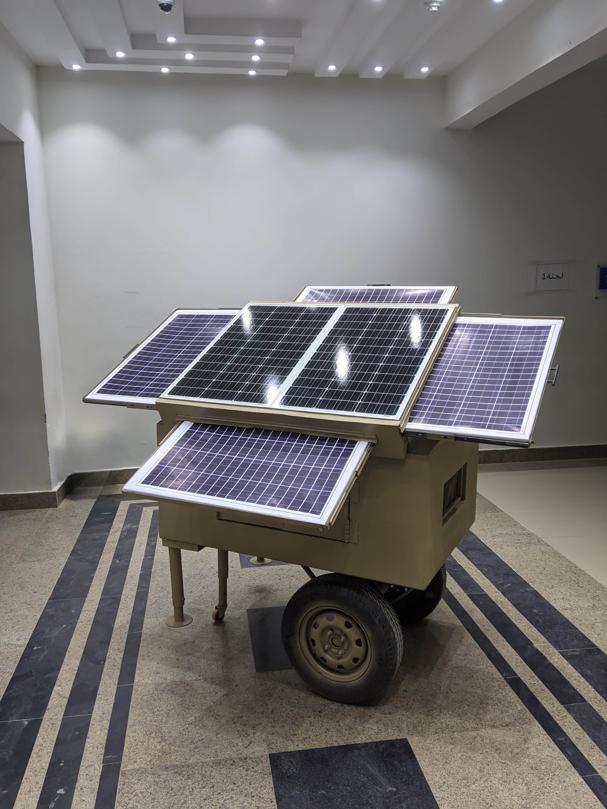
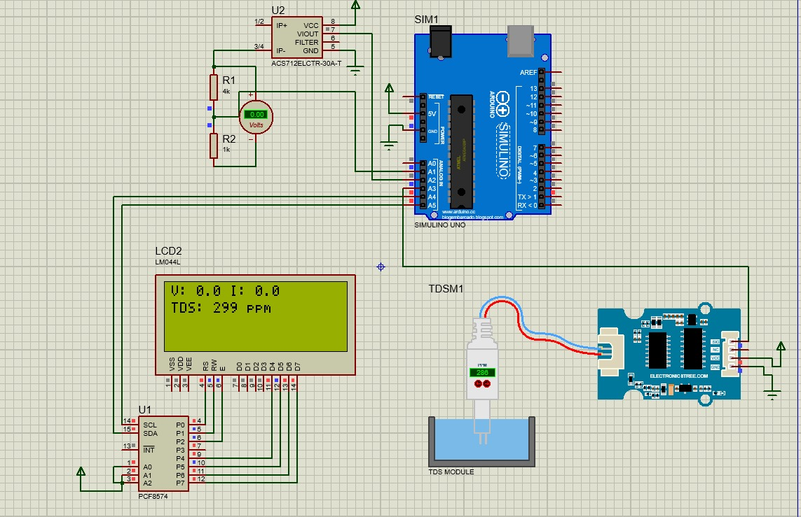

# Octa-Solar: Advanced Solar Water Quality Monitoring System



## 🌟 Project Overview

**Octa-Solar** is an innovative IoT-based water quality monitoring system designed for solar-powered water treatment plants. The system utilizes an **ESP32 microcontroller** (not Arduino) to monitor critical water parameters in real-time, providing comprehensive data analysis, remote monitoring capabilities, and automated control features.

The project name is **self-descriptive**: "Octa" represents the eight main sensors/components being monitored, while "Solar" indicates the solar-powered context of the application.

## 🎥 Project Demo

- **Main Demo Video**: [Project_video.mp4](media/videos/Project_video.mp4)
- **Working Demo**: [while-works-video.mp4](media/videos/while-works-video.mp4)
- **App Interface**: [app-reading.png](media/images/app-reading.png)

## 📋 Table of Contents

- [Features](#-features)
- [System Architecture](#-system-architecture)
- [Hardware Components](#-hardware-components)
- [Software Components](#-software-components)
- [Installation & Setup](#-installation--setup)
- [Wiring Diagram](#-wiring-diagram)
- [Usage Guide](#-usage-guide)
- [API Documentation](#-api-documentation)
- [Mobile App](#-mobile-app)
- [Web Dashboard](#-web-dashboard)
- [Database Schema](#-database-schema)
- [Contributing](#-contributing)
- [License](#-license)

## ✨ Features

### 🔬 Multi-Parameter Monitoring
- **Voltage Monitoring**: Real-time solar panel/battery voltage tracking
- **Current Measurement**: Accurate current sensing using ACS712 sensor
- **Water Quality**: TDS (Total Dissolved Solids) measurement with dual sensor support
- **Flow Rate**: Precise water flow monitoring with YF-S201 sensor
- **Temperature**: Water temperature measurement via UART TDS sensor
- **Light Intensity**: Ambient light monitoring using LDR sensor
- **Pump Control**: Remote pump operation with status feedback

### 🌐 Connectivity & Interface
- **WiFi Enabled**: Remote monitoring and control capabilities
- **Web Dashboard**: Real-time web interface with interactive charts
- **Mobile App**: Cross-platform Flutter application
- **WebSocket Support**: Live data streaming
- **RESTful API**: Comprehensive API for data access and control

### 📊 Data Management
- **MySQL Database**: Persistent data storage
- **Historical Data**: Long-term data logging and analysis
- **Real-time Charts**: Interactive data visualization
- **Alert System**: Configurable thresholds and notifications
- **Data Export**: CSV/JSON data export capabilities

### 🎛️ Advanced Features
- **Sensor Calibration**: Built-in calibration routines
- **Automatic Failover**: Analog TDS backup when UART fails
- **Smart Pump Control**: Automated pump operation based on flow/TDS thresholds
- **User Authentication**: Secure login system with bcrypt encryption
- **Responsive Design**: Mobile-friendly web interface

## 🏗️ System Architecture

The Octa-Solar system follows a distributed architecture:

```
┌─────────────────┐    ┌─────────────────┐    ┌─────────────────┐
│   ESP32 Device  │───▶│  Flask Server   │───▶│  MySQL Database │
│  (Sensors +     │    │  (Python API)   │    │  (Data Storage) │
│   WiFi Module)  │    │                 │    │                 │
└─────────────────┘    └─────────────────┘    └─────────────────┘
         │                       │                       │
         ▼                       ▼                       ▼
┌─────────────────┐    ┌─────────────────┐    ┌─────────────────┐
│   I2C LCD       │    │  Web Dashboard  │    │  Mobile App     │
│  (Local Display)│    │  (Browser)      │    │  (Flutter)      │
└─────────────────┘    └─────────────────┘    └─────────────────┘
```

## 🔧 Hardware Components

### Main Controller
- **ESP32 Development Board** (NOT Arduino - ESP32 is specifically used for its WiFi capabilities and dual-core processing)

### Sensors (The "Octa" - 8 Main Components)
1. **Voltage Sensor** (GPIO 34) - Solar panel/battery voltage monitoring
2. **ACS712 Current Sensor** (GPIO 35) - Current measurement (5A/20A/30A variants)
3. **YF-S201 Flow Sensor** (GPIO 26) - Water flow rate measurement
4. **UART TDS Sensor** (GPIO 16/17) - Primary water quality sensor with temperature
5. **Analog TDS Sensor** (GPIO 32) - Backup water quality measurement
6. **LDR Light Sensor** (GPIO 33) - Ambient light intensity
7. **20x4 I2C LCD** (GPIO 21/22) - Local data display
8. **Water Pump** (GPIO 13) - Controlled via relay/MOSFET

### Additional Components
- **Buzzer** (GPIO 25) - Alert notifications
- **Test Buzzer** (GPIO 27) - System status alerts
- **Green LED** (GPIO 12) - Status indicator
- **Relay Module** - For pump control
- **Logic Level Converter** - For 5V sensor interfacing

## 💻 Software Components

### 1. ESP32 Firmware (`main.c`)
- **Language**: C++ for ESP32
- **Features**:
  - Multi-sensor data acquisition
  - WiFi connectivity and web server
  - WebSocket real-time communication
  - I2C LCD display management
  - UART communication for TDS sensor
  - Interrupt-driven flow measurement
  - Automatic sensor failover
  - Settings storage in EEPROM/Preferences

### 2. Backend Server (`app.py`)
- **Language**: Python with Flask framework
- **Features**:
  - RESTful API endpoints
  - MySQL database integration
  - User authentication with bcrypt
  - CORS support for cross-origin requests
  - Data validation and error handling
  - Real-time sensor data processing

### 3. Mobile Application (`octa_flutter/`)
- **Framework**: Flutter (Dart)
- **Platforms**: Android, iOS, Web, Desktop
- **Features**:
  - Real-time sensor monitoring
  - Pump control interface
  - User authentication
  - Responsive design
  - Offline capability

### 4. Database (`db_setup.sql`)
- **Type**: MySQL
- **Tables**:
  - `sensors`: Sensor readings with timestamps
  - `pump_states`: Pump operation history
  - `users`: User authentication data
  - `total_liters`: Cumulative flow data

## 🚀 Installation & Setup

### Prerequisites
```bash
# System requirements
- ESP32 development board
- Python 3.8+
- MySQL 8.0+
- Flutter SDK 3.0+ (for mobile app)
- Arduino IDE or PlatformIO (for ESP32 programming)
```

### 1. Database Setup
```sql
# Run the database setup script
mysql -u root -p < db_setup.sql

# Or manually execute:
CREATE DATABASE octa CHARACTER SET utf8mb4 COLLATE utf8mb4_general_ci;
CREATE USER 'adminuser'@'localhost' IDENTIFIED BY 'strongpassword';
GRANT ALL PRIVILEGES ON octa.* TO 'adminuser'@'localhost';
```

### 2. ESP32 Firmware Setup
```cpp
// Update WiFi credentials in main.c
const char* ssid = "Your_WiFi_SSID";
const char* password = "Your_WiFi_Password";

// Update server IP if needed
// Default server IP: 192.168.223.6
```

### 3. Backend Server Setup
```bash
# Install Python dependencies
pip install flask mysql-connector-python flask-cors bcrypt

# Run the server
python app.py
# Server will start on http://0.0.0.0:5000
```

### 4. Mobile App Setup
```bash
cd octa_flutter/
flutter pub get
flutter run
# Or build APK: flutter build apk
```

## 🔌 Wiring Diagram

### Complete Wiring Configuration

| Component | ESP32 Pin | Connection Details |
|-----------|-----------|-------------------|
| **Voltage Sensor** | GPIO 34 | Signal → GPIO 34, VCC → 3.3V/5V, GND → GND |
| **ACS712 Current** | GPIO 35 | OUT → GPIO 35, VCC → 5V, GND → GND, IP+/IP- → Load |
| **YF-S201 Flow** | GPIO 26 | Signal → GPIO 26, VCC → 5V, GND → GND |
| **LDR Sensor** | GPIO 33 | LDR → GPIO 33 & 3.3V, 10kΩ resistor → GPIO 33 & GND |
| **Main Buzzer** | GPIO 25 | Positive → GPIO 25, Negative → GND |
| **Water Pump** | GPIO 13 | Relay IN → GPIO 13, Pump → External power via relay |
| **Test Buzzer** | GPIO 27 | Positive → GPIO 27, Negative → GND |
| **Status LED** | GPIO 12 | Anode → GPIO 12 via 220Ω resistor, Cathode → GND |
| **Analog TDS** | GPIO 32 | Signal → GPIO 32, VCC → 3.3V/5V, GND → GND |
| **UART TDS TX** | GPIO 16 | TDS TX → GPIO 16 (via level converter if 5V) |
| **UART TDS RX** | GPIO 17 | TDS RX → GPIO 17 (via level converter if 5V) |
| **I2C LCD SDA** | GPIO 21 | SDA → GPIO 21, VCC → 5V, GND → GND |
| **I2C LCD SCL** | GPIO 22 | SCL → GPIO 22 |



**Important Notes**:
- Use logic level converters for 5V sensors connecting to ESP32 3.3V GPIO
- Add pull-up resistors (4.7kΩ) for I2C lines if communication is unstable
- Ensure proper power supply ratings for all components
- Use flyback diodes for inductive loads (pump/relays)

## 📖 Usage Guide

### 1. Initial Setup
1. Power on the ESP32 with all sensors connected
2. The system will attempt WiFi connection (check LCD for status)
3. Access the web interface at `http://ESP32_IP_ADDRESS`
4. Create user account via mobile app or API

### 2. Web Dashboard Access
```
http://192.168.223.6          # Flask server welcome page
http://192.168.223.6/web/     # Flutter web app
http://ESP32_IP_ADDRESS       # ESP32 web interface (direct)
```

### 3. Mobile App Usage
1. Install the APK or run in development mode
2. Login with created credentials
3. Monitor real-time sensor data
4. Control pump operations remotely
5. View historical trends and alerts

### 4. Sensor Calibration
- **TDS Sensor**: Use calibration button in web interface or send calibration command
- **Flow Sensor**: Adjust `FLOW_CALIBRATION_FACTOR` based on sensor specifications
- **Current Sensor**: Modify `ACS712_offset` for zero-current calibration

## 🔗 API Documentation

### Authentication Endpoints
```bash
# User Registration
POST /api/signup
Content-Type: application/json
{
  "username": "user",
  "password": "pass123",
  "email": "user@example.com"
}

# User Login
POST /api/login
Content-Type: application/json
{
  "username": "user",
  "password": "pass123"
}
```

### Data Endpoints
```bash
# Get Latest Sensor Data
GET /api/sensors
Response: {
  "sensors": [{"timestamp": "...", "sensor_type": "voltage", "value": 12.5}],
  "pump_states": [{"timestamp": "...", "state": 1, "pump_id": 1}],
  "total_liters": [{"timestamp": "...", "pump_id": 1, "value": 150.5}]
}

# Update Sensor Data (ESP32 → Server)
POST /update
Content-Type: application/json
{
  "voltage": 12.5,
  "current": 2.1,
  "tds": 450.0,
  "flow": 3.2,
  "light": 1024,
  "switch": 1,
  "pump_id": 1,
  "total_liters": 150.5
}

# Control Pump
POST /api/switch
Content-Type: application/json
{
  "state": 1,
  "pump_id": 1
}
```

### WebSocket Communication (ESP32)
```javascript
// Connect to ESP32 WebSocket
ws = new WebSocket('ws://ESP32_IP:81/');

// Send settings
ws.send(JSON.stringify({
  "flowCalibration": 7.5,
  "acsOffset": 2.5,
  "tdsThreshold": 1000.0,
  "flowThreshold": 0.5
}));
```

## 📱 Mobile App

### Features
- **Cross-platform**: Android, iOS, Web, Desktop support
- **Real-time monitoring**: Live sensor data with 2-second refresh
- **Pump control**: Remote pump operation with confirmation
- **Material Design**: Clean, intuitive interface
- **Offline capability**: Local storage for authentication

### Screenshots
- **Dashboard**: Real-time sensor readings with color-coded cards
- **Pump Control**: Toggle switches with visual feedback
- **Authentication**: Secure login/signup with validation

### Build Instructions
```bash
# Development build
flutter run

# Release APK
flutter build apk --release

# Web build
flutter build web

# Desktop build (Windows/Linux/macOS)
flutter build windows/linux/macos
```

## 🌐 Web Dashboard

### Features
- **Responsive design**: Works on desktop, tablet, and mobile
- **Real-time charts**: Interactive Chart.js visualizations
- **Multi-tab interface**: Dashboard, History, and Settings
- **WebSocket updates**: Live data streaming
- **Settings panel**: Sensor calibration and threshold configuration

### Tabs
1. **Dashboard**: Live sensor readings with charts
2. **History**: Historical data visualization
3. **Settings**: Calibration and threshold adjustment

## 🗃️ Database Schema

### Tables Structure
```sql
-- Sensor readings
CREATE TABLE sensors (
    id BIGINT AUTO_INCREMENT PRIMARY KEY,
    timestamp DATETIME NOT NULL,
    sensor_type VARCHAR(50) NOT NULL,  -- 'voltage', 'current', 'tds', etc.
    value FLOAT NOT NULL,
    INDEX idx_timestamp (timestamp),
    INDEX idx_sensor_type (sensor_type)
);

-- Pump operation states
CREATE TABLE pump_states (
    id BIGINT AUTO_INCREMENT PRIMARY KEY,
    timestamp DATETIME NOT NULL,
    state TINYINT NOT NULL,      -- 0 = OFF, 1 = ON
    pump_id INT NOT NULL,        -- Support multiple pumps
    INDEX idx_timestamp (timestamp),
    INDEX idx_pump_id (pump_id)
);

-- User authentication
CREATE TABLE users (
    id INT AUTO_INCREMENT PRIMARY KEY,
    username VARCHAR(50) NOT NULL UNIQUE,
    password VARCHAR(255) NOT NULL,    -- bcrypt hashed
    email VARCHAR(100) NOT NULL UNIQUE,
    created_at DATETIME DEFAULT CURRENT_TIMESTAMP
);

-- Cumulative flow data
CREATE TABLE total_liters (
    id BIGINT AUTO_INCREMENT PRIMARY KEY,
    timestamp DATETIME NOT NULL,
    pump_id INT NOT NULL,
    value FLOAT NOT NULL,             -- Total liters pumped
    INDEX idx_timestamp (timestamp)
);
```

## 🔧 Technical Specifications

### ESP32 Configuration
- **Microcontroller**: ESP32 (dual-core, WiFi enabled)
- **Clock Speed**: 240MHz
- **Flash Memory**: 4MB
- **WiFi**: 802.11 b/g/n
- **ADC Resolution**: 12-bit
- **GPIO Pins**: 30+ usable pins

### Sensor Specifications
- **Voltage Range**: 0-30V (with voltage divider)
- **Current Range**: 0-30A (depending on ACS712 variant)
- **TDS Range**: 0-2000 ppm
- **Flow Range**: 1-30 L/min
- **Temperature Range**: 0-100°C
- **Light Range**: 0-4095 (ADC counts)

### Communication Protocols
- **WiFi**: IEEE 802.11 b/g/n
- **I2C**: 100kHz for LCD communication
- **UART**: 9600 baud for TDS sensor
- **HTTP/HTTPS**: RESTful API communication
- **WebSocket**: Real-time bidirectional communication

## 🚨 Troubleshooting

### Common Issues

1. **WiFi Connection Failed**
   - Check SSID and password in code
   - Ensure ESP32 is within WiFi range
   - Verify router 2.4GHz support

2. **Sensor Reading Issues**
   - Verify wiring connections
   - Check power supply voltage levels
   - Ensure proper grounding

3. **LCD Display Problems**
   - Confirm I2C address (0x27 or 0x3F)
   - Add pull-up resistors if needed
   - Check LCD module power requirements

4. **Database Connection Errors**
   - Verify MySQL service is running
   - Check database credentials
   - Ensure network connectivity

5. **Mobile App Issues**
   - Verify server IP address in code
   - Check network connectivity
   - Ensure API endpoints are accessible

## 🤝 Contributing

We welcome contributions to the Octa-Solar project! Please follow these guidelines:

1. **Fork the repository**
2. **Create a feature branch**: `git checkout -b feature/new-feature`
3. **Commit changes**: `git commit -am 'Add new feature'`
4. **Push to branch**: `git push origin feature/new-feature`
5. **Create Pull Request**

### Development Setup
```bash
# Clone repository
git clone https://github.com/yourusername/Octa-Solar.git
cd Octa-Solar

# Setup development environment
pip install -r requirements.txt
cd octa_flutter && flutter pub get
```

## 📄 License

This project is licensed under the MIT License - see the [LICENSE](LICENSE) file for details.

## 👨‍💻 Author

**Abdulla Badawy** - *Project Developer*
- GitHub: [@Abdullah-Badawy1](https://github.com/Abdullah-Badawy1)
- Email: abdallahbadawy109@gmail.com

## 🙏 Acknowledgments

- ESP32 community for excellent documentation
- Flutter team for cross-platform framework
- MySQL for robust database solution
- Chart.js for web visualization
- Open source community for various libraries

## 📊 Project Stats

- **Lines of Code**: 2000+ (ESP32 C++, Python, Dart combined)
- **Supported Platforms**: ESP32, Android, iOS, Web, Desktop
- **Database Tables**: 4 main tables
- **API Endpoints**: 8+ RESTful endpoints
- **Sensor Types**: 8 different sensors monitored
- **Real-time Updates**: WebSocket + HTTP polling

---

**Note**: This project uses ESP32 specifically for its advanced features including dual-core processing, WiFi capability, and extensive GPIO options. Arduino boards lack the necessary features for this comprehensive IoT application.

For detailed technical documentation, wiring diagrams, and setup instructions, please refer to the [wire.md](media/documentation/wire.md) file.

**Project Video**: [Project_video.mp4](media/videos/Project_video.mp4) | **Working Demo**: [while-works-video.mp4](media/videos/while-works-video.mp4)
